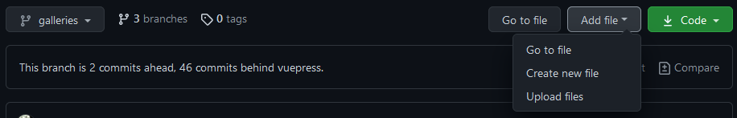
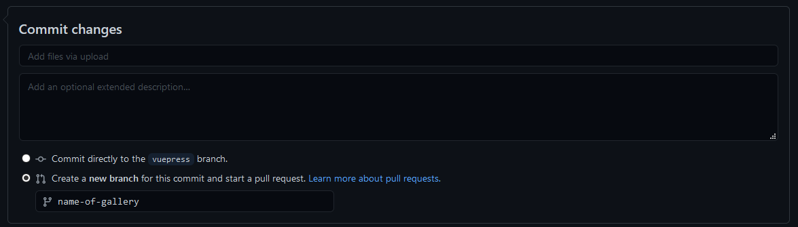
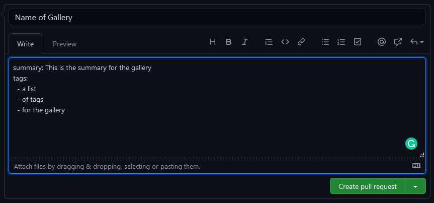

# Uploading Galleries
1. Select `Upload files` from the `Add file` dropdown

2. Choose you images to add to the repository
    * In the `Commit Changes`, select the `Create a new branch` option and name the branch the name of the new gallery.
  
3. When prompted to `Open a pull request`, fill in anything specific or extra you would like for the new gallery.
  
4. Click `Create pull request` to send me the notification, and I will get those images added to the website and deployed out.
